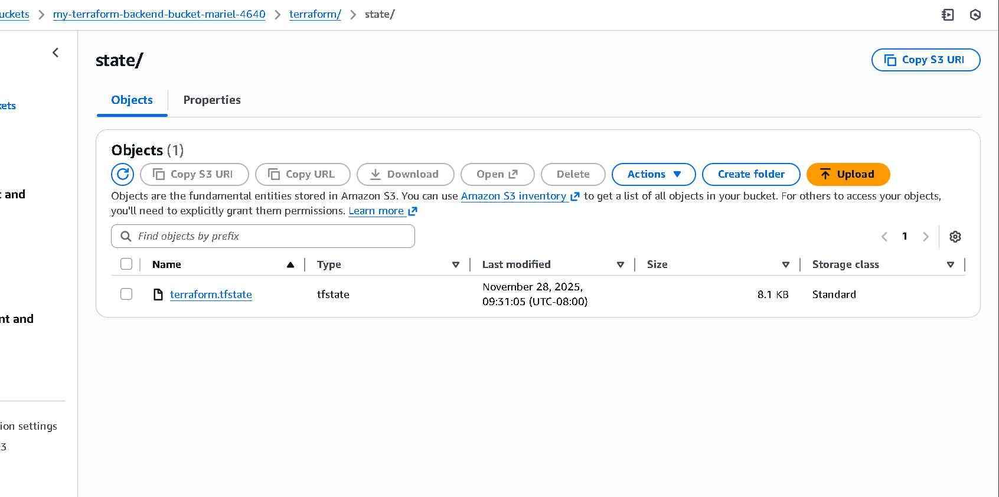
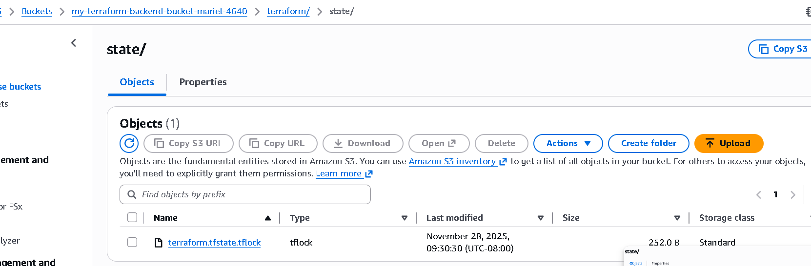

# terraform-s3-backend-lab
s
Q: When is the state file created?
A: The state file is created immediately after running terraform init, when Terraform uploads the initial state to the S3 backend.

Q: When is the lock file present?
A: The lock file appears only during operations that modify the state (e.g., terraform apply, terraform destroy).

Q: Is the lock file always present after it is created?
A: No, the lock file is temporary and is deleted automatically when the Terraform operation finishes.
## Backend Configuration

The Terraform backend uses an AWS S3 bucket to store the state and lock file.
State file only:
 # state file only

State + lock file:
 # state file lock

See lab instructions on D2L.

